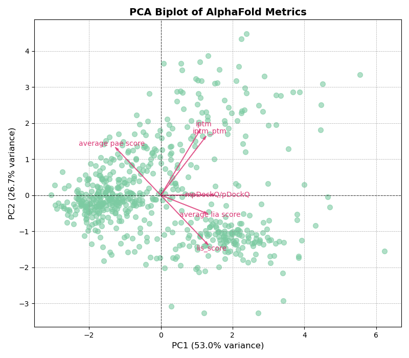
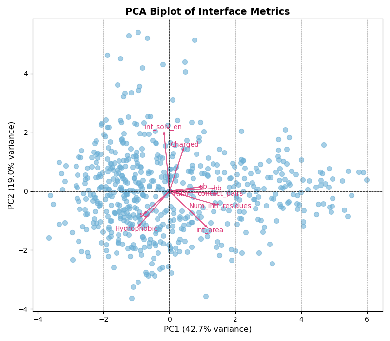

# Training your own model
In this repository, we give you the [architecutre of our model](TF_binder_model.py), and an example on how to [train](train_model.py) your own model. 

## Preparing Features

To look at how we prepared our features, [click here](preparing_features.py).

*Inputted Features*

We performed PCA on AlphaFold Metrics and Interface features to asses their contribution to the variance in the dataset. 

For AlphaFold Metrics, the first two principal components (PC1 and PC2) account for ~79.7% of the total variance. PC1 alone explains for 53.0%. As seen below, features such as ipTM, average PAE score, and mpDockQ/pDockQ highlight a strong directional influence on PC1; therefore, adding these features will facilitate with downstream modeling. 

For Interface Features, the first two principal components (PC1 and PC2) account for ~61.7% of the total variance. PC1 explains 42.7% of that total. Using both the PCA and previous research, we used specific biochemical and interface properities to model the binding (2-4).

 

**AlphaFold Features:**
1. [ipTM](https://www.ebi.ac.uk/training/online/courses/alphafold/inputs-and-outputs/evaluating-alphafolds-predicted-structures-using-confidence-scores/confidence-scores-in-alphafold-multimer/)
2. [Average PAE score](https://www.ebi.ac.uk/training/online/courses/alphafold/inputs-and-outputs/evaluating-alphafolds-predicted-structures-using-confidence-scores/pae-a-measure-of-global-confidence-in-alphafold-predictions/)
3. [mpDockQ/pDockQ](https://www.nature.com/articles/s41467-022-33729-4) (1)

**Interface Features:**
1. interface solvation energy
2. Charge
3. Hydrophobicity
4. Number of Contact pairs in the interface
5. The interface surface area

Furthermore, transcription factor and domain sequence was added as a feature. To add sequence to your csv file from the fasta file, look at this [code](../scripts/preparing_data.py)

Features were normalized to each domain using a ```StandardScaler``` and saved as a ```joblib```. 

```python
def prepare_features(df, structure_features, af_features, save_scalers=True):
    """Prepare and scale features for model training, with domain-specific normalization."""
    seq_features = np.array(df['encoded_sequence'].tolist())
    struct_features = df[structure_features].values  # Correctly use structure_features
    alphafold_features = df[af_features].values  # Correctly use af_features
    domain_sequences = np.array(df['encode_domain'].tolist())
    
    # Initialize arrays to store the scaled features
    struct_scaled = np.zeros_like(struct_features)
    alphafold_scaled = np.zeros_like(alphafold_features)

    struct_scaler = StandardScaler()
    alphafold_scaler = StandardScaler()

    struct_scaled = struct_scaler.fit_transform(struct_features)
    alphafold_scaled = alphafold_scaler.fit_transform(alphafold_features)
    
    if save_scalers:
        domain_scalers = {'structure': struct_scaler, 'alphafold': alphafold_scaler}
    
    return seq_features, struct_scaled, alphafold_scaled, df['Transformed Kd (nM)'].values, domain_sequences, domain_scalers
```

Each amino acid in transcription factor and domain sequence is converted to an index based on a 1-based encoding (0 is reserved for padding). To uniform sequences, each sequence is truncated or padded to uniform length of 50 to help with convergence and learning. 

```python
aa_to_index = {aa: i + 1 for i, aa in enumerate("ACDEFGHIKLMNPQRSTVWY")}  # 1-based index, 0 for padding

def encode_sequence(sequence, aa_to_index, max_length=50):
    """Convert sequence to token indices for transformer embedding"""
    if not isinstance(sequence, str):
        return [0] * max_length  # Return all padding if sequence is missing
    sequence = sequence[:max_length]  # Truncate long sequences
    return [aa_to_index.get(aa, 0) for aa in sequence] + [0] * (max_length - len(sequence))
```

To see an example of features processed and an example of dataset to train model, [click here](.../trained_model/overall_prediction/information/processed_data.csv)

*Target Output*

The target output is considered to be a Transformed Kd value between 0-1. We performed a min-max normalization on experimental Kd values (2).

For the overall model, which includes every domain, the max_kd = 100569.66 nM and the min_kd = 1172.55 nM. 

For each domain: 
- KIX: max_kd = 100569.66 nM; min_kd = 1172.55 nM
- NCBD: max_kd = 88602.08 nM; min_kd = 8707.01 nM
- TAZ1: max_kd = 53489.15 nM; min_kd = 13385.2 nM
- TAZ2: max_kd = 46358.97 nM; min_kd = 1836.22 nM

```python
# Normalize Kd values
    df["Transformed Kd (nM)"] = 1 - (df['Kd (nM)'] - df['Kd (nM)'].min()) / (df['Kd (nM)'].max() - df['Kd (nM)'].min())
    print(df['Kd (nM)'].max())
    print(df['Kd (nM)'].min())
```

## Model Architecture Overview

*Enhnaced Feature Processing*

The inputs of AlphaFold Metrics, transcription factor sequence, domain sequence, domain category, interface structure metrics are transformed to a high dimensional representation in ```Enhanced Feature Processing```.

1. **Linear Projection**: Features are first passed through a fully connected linear that projects them from the original dimension (```input_dim```) to a higher dimensional space (```output_dim```) output dimension.
2. **Layer Normalization**: After this, features are normalized using a ```LayerNorm```.
3. **GELU Activation**: These normalized features are then passed through a GELU (Gaussian Error Linear Unit) activation, which softly weights input values.
4. **Residual Blocks**: The activated features are processed by a layer of residual blocks for the model to learn deeper transformations and preserving the original information. 

```python 
class EnhancedFeatureProcessor(nn.Module):
    """"Processes the input features."""
    def __init__(self, input_dim, output_dim, num_layers=2, dropout=0.1):
        super(EnhancedFeatureProcessor, self).__init__()
        self.input_layer = nn.Linear(input_dim, output_dim)  # Project input_dim -> output_dim
        self.norm = nn.LayerNorm(output_dim) #helps with the stabilization and convergence of training
        self.residual_blocks = nn.ModuleList([
            ResidualBlock(output_dim, dropout) for _ in range(num_layers)
        ])

    def forward(self, x):
        x = self.input_layer(x)  # Always project at the beginning
        x = self.norm(x)
        x = F.gelu(x) #helps with a smoother and more expressive activation

        for block in self.residual_blocks: #deepends the network 
            x = block(x)

        return x
```

*Cross Attention*

This module creates contextual relationship between different features by apply cross-attention helping the model learn about what parts of the input are most relevant to another. 

In this architecture, cross attention is used to model the folling interactions, 
1. Transcription factor sequences and interface structural features
2. Transcription factor sequence and AlphaFold Metrics
3. Domain sequences and AlphaFold Metrics

**How it works**:

This is a classic mechanism called [query-key-value (QKV)](https://poloclub.github.io/transformer-explainer/).

- Query (Q): the question; what we are focusing on?
- Key (K): the reference; what portions of the data is relevant?
- Value (v): the content; what information should be retrieved and passed forward?

```python
class CrossAttention(nn.Module):
    """allows for the model to understand what pieces of the input are the most important for generating the output.

    The model asks the question what is the most important (query), finds an answer to the question (key), and then focuses on 
    the actual info (value)"""
    def __init__(self, query_dim, key_dim, embed_dim, num_heads=4, dropout=0.2):
        super(CrossAttention, self).__init__()
        self.query_proj = nn.Linear(query_dim, embed_dim) #question 
        self.key_proj = nn.Linear(key_dim, embed_dim) #answer
        self.value_proj = nn.Linear(key_dim, embed_dim) #value
        self.attention = nn.MultiheadAttention(embed_dim, num_heads, dropout=dropout, batch_first=True)
        self.norm = nn.LayerNorm(embed_dim)
        
    def forward(self, query, key_value):
        # First apply projections
        q = self.query_proj(query)
        k = self.key_proj(key_value)
        v = self.value_proj(key_value)
        
        # Then apply normalization
        q = self.norm(q).unsqueeze(1)  # Add a sequence dimension
        k = self.norm(k).unsqueeze(1)
        v = self.norm(v).unsqueeze(1)
        
        attn_output, _ = self.attention(q, k, v)
        return attn_output.squeeze(1)
```

*Transformation Encoding*

A shared transformer encoder is used for both transcription factor and domain sequences, allowing the model to learn the contextual representations of these sequences. To further this learning, we added a residual connection to retain the original sequence information to stabalize learning. 

```python
#in the def __init__...
Transformer Encoder with more capacity and layers
    encoder_layer = nn.TransformerEncoderLayer(
        d_model=embed_dim,
        nhead=num_heads,
        dim_feedforward=hidden_dim * 2,  # Increased capacity
        dropout=dropout,
        batch_first=True,
        activation="gelu"  # Better activation function
        )
    self.transformer_encoder = nn.TransformerEncoder(encoder_layer, num_layers=num_layers) #this is shared between domain and tf to preserve raw sequence info 

#in the forward
    #Process transcription factor sequence features
    seq_transformer_in = seq_features.unsqueeze(1)  # Add sequence dimension
    seq_transformer_out = self.transformer_encoder(seq_transformer_in).squeeze(1)
    seq_out = seq_transformer_out + seq_features  # Residual connection
        
    # Process domain sequence features
    domain_seq_features = self.domain_seq_processor(domain_seq_input)
    domain_seq_transformer_in = domain_seq_features.unsqueeze(1)
    domain_seq_transformer_out = self.transformer_encoder(domain_seq_transformer_in).squeeze(1)
    domain_seq_out = domain_seq_transformer_out + domain_seq_features  # Residual connection
```

*Feature Fusion*

Before the final layers, all the processed features are fused toether into a single representation. This fusion enables the model to integrate multiple modalities-- such as sequence, structure, and AlphaFold-metrics-- into a unified view for downstream prediction. 

A fusion gate dynamically learn the importance of each modality essentially amplifying informative signal while supressing irrelevant noise. 

```python
#in the def __init__...
    self.fusion_gate = nn.Linear(combined_dim, combined_dim)

#in the forward
    # Combine all features
    combined = torch.cat([
        seq_out,
        struct_out,
        alphafold_out,
        domain_seq_out], dim=1)
    # Apply normalization to combined features
    gate = torch.sigmoid(self.fusion_gate(combined) #emphasize more important and informative inputs and down-weights less relevant ones based on the current context -> taking out noise
    combined = combined * gate  # Gated feature fusion
    combined = self.combined_norm(combined)
```

*Output Layer*

The final layers consist of a fully connected layer followed by a GELU activation and a dropout for regulization. 

A domain-specific bias is then added to capture the differences in binding behavior across the different domains. The output is passed through a sigmoid activation, ensuring the final score to be between 0-1. 

## Training Model

The training code is highlighted [here](train_model.py). When training our model, we wanted to make sure can identify the key transcription factors that bind strongly to the any EP300 domain (Top 25%) while mainitng overall predictive accuracy. 


**Custom Loss Function**
We created a custom loss function to prioritize performance in both Top 25% binders and overall accuracy. 

The weight function \( w_i \) is defined as:

\[
w_i = 
\begin{cases}
1 + \alpha (p_i - \tau_1 - \tau)^\gamma & \text{if } p_i \geq \tau_1 \\
1 + \alpha (1 - \tau p_i - \tau)^\gamma & \text{otherwise}
\end{cases}
\]


## References
[1] Bryant, P., Pozzati, G., Zhu, W. et al. Predicting the structure of large protein complexes using AlphaFold and Monte Carlo tree search. Nat Commun, 13, 6028 (2022). [Paper Link](https://www.nature.com/articles/s41467-022-33729-4).

[2] DelRosso, Nicole, et al. “High-Throughput Affinity Measurements of Direct Interactions between Activation Domains and Co-Activators.” bioRxiv, Jan. 2024, p. 2024.08.19.608698,[Paper Link](https://doi.org/10.1101/2024.08.19.608698).

[3] Már, Matti, et al. “Multifunctional Intrinsically Disordered Regions in Transcription Factors.” Chemistry – A European Journal, vol. 29, no. 21, Apr. 2023, p. e202203369, [Paper Link](https://doi.org/10.1002/chem.202203369).

[4] Ravarani, Charles NJ, et al. “High‐throughput Discovery of Functional Disordered Regions: Investigation of Transactivation Domains.” Molecular Systems Biology, vol. 14, no. 5, 2018, p. e8190, [Paper Link](https://doi.org/10.15252/msb.20188190).
