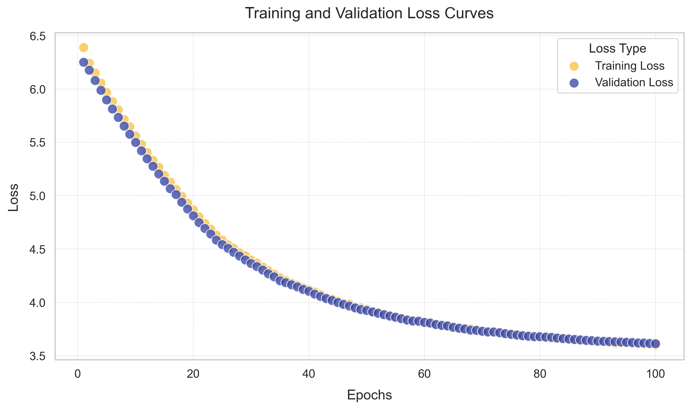
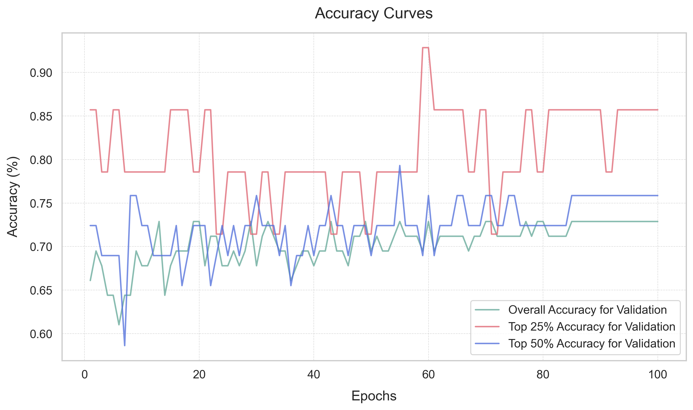

## Our trained models

We created five models, each trained on a different distribution of Transformed Kd Values depending on the domain or the overall datase. To learn how we trained and more about the architecture of the model, [click here](../toolkit_to_train).
In this README, we will be going throuhg an example of our [general-pupose model](overall_prediction) that has been trained across al the domains to predict binding affinity. 


  

**Performance Metrics**:

- Training Progress: Converged over 100 epochs with final loss of ~3.6; no signs of overfitting
- Validation Performance:
  - R^2 for validating: 0.82
  - Overall Accuracy: ~70%
  - Top 25% accuracy: ~85%
- Testing Performance:
   - R^2 for testing: 0.77

## How to run and create a prediction

In this README, I will be using the overall_prediction model as an example on how to run and create a prediction. 

The steps: 
1. AlphaPulldown
2. Preparing inputs
3. creating prediction

*Setting up Environment*

Create a conda environment with the necessary packages stated in the main page [README](../README.md)

To download this repository:
```bash
git clone https://github.com/castral02/tf_binding.git
```

*AlphaPulldown*

As stated in the main page [README](../README.md), we ran our AlphaPulldown's on the NIH HPC Biowulf Cluster. 

The necessary files are needed in the folder to run AlphaPulldown. To look at an example of a folder, [click here](examples/alphapulldown_files)

To create sbatch files in a high throughput manner, we created this code for [colabfold search](../tf_binding/scripts/colab.py) and for [AlphaPulldown](../tf_binding/scripts/pulldown.py). 

To run these, we created this code: [running_colab.py](../tf_binding/scripts/running_colab.py) and [running_pulldowns.py](../tf_binding/scripts/running_pulldowns.py).

Sbatch files will look like this...

For ColabFold Search:

```bash
#!/bin/bash
#SBATCH --job-name=KIX_colab       # Give your job a name
#SBATCH --partition=norm                # Specify the correct GPU partition
#SBATCH --mem=200G                      # Request 256GB of memory (adjust as necessary)
#SBATCH --cpus-per-task=16              # Request 32 CPU cores (adjust as necessary)
#SBATCH --gres=lscratch:50             # Request 100GB of local scratch space               
#SBATCH --time=3-24:00:00                   # Set a time limit for the job (6 hours)
#SBATCH --output=output/KIX_colab.log    # Unique output log for each job
#SBATCH --error=error/KIX_colab.log      # Unique error log for each job
#SBATCH --mail-type=END,FAIL   # Send email on job completion (END) or failure (FAIL)
#SBATCH --mail-user=  # Replace with your email address

set -e
set -x  # Enable debugging

# Load necessary modules
module load colabfold alphapulldown/0.30/7

# Specify your input and output directories
INPUT_DIR="/data/CBLCCBR/crebbp_ep300/crebbp/KIX"   # Set input directory dynamically
OUTPUT_DIR="/data/CBLCCBR/crebbp_ep300/crebbp/KIX"      # Set output directory dynamically

# Create individual features
create_individual_features.py --fasta_paths=$INPUT_DIR/bait.fasta,$INPUT_DIR/candidate.fasta --output_dir=$OUTPUT_DIR/pulldown_cf_msas --use_precomputed_msas=True --max_template_date=2023-01-01 --use_mmseqs2=True --skip_existing=True
```

For AlphaPulldown:

```bash
#!/bin/bash
#SBATCH --job-name=KIX_alphapulldown      # Name the job for CREBBP Full
#SBATCH --partition=gpu                        # Specify the GPU partition
#SBATCH --mem=200G                             # Request memory (adjust if necessary)
#SBATCH --cpus-per-task=16                     # CPU cores (adjust if necessary)
#SBATCH --gres=lscratch:50,gpu:a100:1          # Request GPU and scratch space
#SBATCH --time=3-24:00:00                         # Job time limit (6 hours)
#SBATCH --output=output/KIX.log    # Unique output log for each job
#SBATCH --error=error/KIX.log      # Unique error log for each job
#SBATCH --mail-type=END,FAIL                   # Email on job completion or failure
#SBATCH --mail-user= # Replace with your email

set -e
set -x  # Enable debugging

# Load necessary modules
module load colabfold alphapulldown/0.30.7

# Change to the input directory
cd "/data/CBLCCBR/crebbp_ep300/crebbp/KIX"

# Run the AlphaPulldown job in this folder
run_multimer_jobs.py     --mode=pulldown     --num_cycle=3     --num_predictions_per_model=2     --output_path=pulldown_models     --protein_lists=bait.txt,candidate.txt     --monomer_objects_dir=pulldown_cf_msas

run_get_good_pae.sh --output_dir pulldown_models --cutoff=50

cd "/data/CBLCCBR/scripts/heterodimer"

source myconda

conda activate myenv

python3 creating_excel.py -output_dir=/data/CBLCCBR/crebbp_ep300/crebbp/KIX/pulldown_models

rm -rf /data/CBLCCBR/crebbp_ep300/crebbp/KIX/pulldown_cf_msas
```

*Preparing Features*

Some features from the AlphaPulldown pipeline is not attached to the output csv file ([example of AlphaPulldown Output](../examples)). To prepare this, you will need to run two codes:

1. [Extracting PAE score](../scripts/lia_lis.py)

```bash
python3 lia_lis.py -output_dir=/directory/to/AlphaPulldown/files
```

2. [Grabbing domain categories and transcription factor and domain sequences](../scripts/preparing_data.py)

```bash
python3 preparing_data.py -fasta=/path/to/fasta -csv=/path/to/csv/file -protein=EP300orCREBBP
```
  a. fasta file: the fasta file of candidate proteins the user used to run AlphaPulldown
  b. csv: csv file after the PAE score has been extracted

To have an example of a csv file to input to predict scores, [click here](../examples)

*Creating a Prediction*

To create a prediction...
```bash
cd trained_model/overall_prediction
python creating_prediction.py 
```

[An example of an output](../examples)
